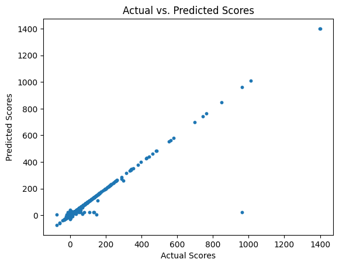

# Milestone 2
## Preprocessing
To clean up the data, we got rid of some features that we decided we were not going to use, such as url, author, token_count.
We also decided to use only english comments so we used the language feature to remove the rows that were not classified as english.
We removed punctuation from our data and also made all the comments lowercase. 
We removed common words like it, the, a, and, to for the purpose of finding patterns with the words in the comments. These words are known as stopwords.


## Milestone 2 Data Exploration
We made a chart of some frequently used words in comments and the scores they had. We used a smaller version of the dataframe for our initial data exploration due to the sheer size of our data set.

We started by exploring the most common words.


We then discovered some more insights on threads with the most "enthusiastic" comment participation.

File Link: [LocalPartialExploration.ipynb](DataCleaning/LocalPartialExploration.ipynb)

We also looked at the relation of score with words as a different overall metric.


File Link: [DataExploration.ipynb](DataCleaning/DataExploration.ipynb)


# Milestone 3
Data Source File Link: [Data Source](https://huggingface.co/datasets/OpenCo7/UpVoteWeb)

## Milestone 3 Pre-Processing
By first creating a linear regression model to look for linear a relationship between the comment "score," and the vectorized content of the comment, we found that the data is more complex than that of a linear relationship. This result is expected. However, it informs us of how our data behaves and will hopefully be useful in creating a neural network to develop a better model.



```
Training MSE: 126.049984140098530
Training RMSE: 11.227198410115435
Training R2: 0.935646036891904
Test MSE: 26209.919273598203290
Test RMSE: 161.894778401275829
Test R2: -6.699233625008288
```

File Link: [PreProcess.ipynb](Pre_Processing/PreProcess.ipynb)

We then started an early implementation of an RNN network on a small portion of the dataset of 50000 entries. It had better performance on the testing dataset compared to the linear model, but it was still clear that it had a long way to go. We plan next week to use the super computer to run the model on the full dataset.


```
Training MAE: 14.323173522949219
Training MSE: 8630.5068359375
Test MAE: 14.083123207092285
Test MSE: 6337.0185546875
```

File Link: [LocalPreProcess.ipynb](Pre_Processing/LocalPreProcess.ipynb)

## Questions
### Where does your model fit in the fitting graph?
The linear regression model has a decent fit for lower scores that are close to zero. At these low scores, the model predicts well since the points are close to the generated diagonal line. However, with higher values, the model has a very poor fit and the predicted values deviate significant from the actual scores. Thus, there is a negative R-squared which indicates poor generalizability for the given model.

The small RNN model also had only tried to mainly fit for the scores near zero. It had slightly better performance, but the overall fit on the graph is still rather bad.

### What are the next models you are thinking of and why?
The next model that we would like to consider is an RNN or a CNN to create a better predictive model based on the full dataset, the nature of the keywords, the context of the subreddit, and the upvote/downvote score.

### Conclusion
As stated above, we concluded that the linear model is and a small RNN are insufficient to represent our data. However, we hope that in evaluating other categorical features, we can build a more robust model through neural networks to evaluate features such as the nature of the keyword, the context of the subreddit, in addition to the upvote/downvote score.
