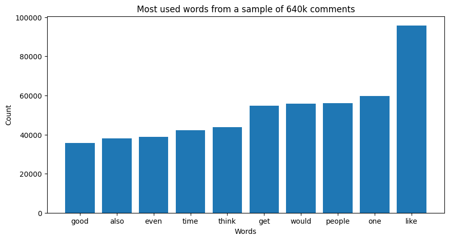
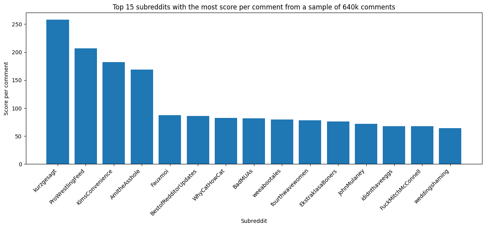
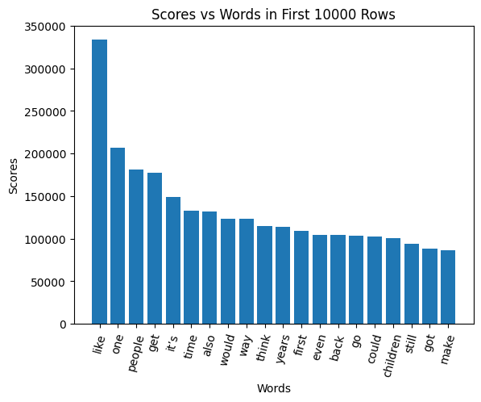

## Introduction
The objective of the project is to explore the relationship between keywords and upvotes of reddit comments. Firstly, we want to predict the keywords that yield the highest upvote tally on the platform Reddit. Secondly, we plan to classify comments and posts categorically based on the subreddit of the comment. The dataset we will be using is a very large, clean dataset; it contains more than twelve million rows of data containing information about each comment within a Reddit post. We will use features such as the content of the comment, and the comment score (the number of downvotes subtracted from the number of upvotes). We also plan to use information such as the subreddit, and post/comment IDs in order to further understand our data. To summarize, the end result will provide a better understanding of human interaction on the Reddit platform, as well as the factors that play a role in the engagement and support for topics in the online community. 

## Methods
### Preprocessing
To clean up the data:
- We got rid of some features that we decided we were not going to use - such as url, author, and token_count.
- We also decided to use only english comments so we used the language feature to remove the rows that were not classified as english.
- We removed punctuation from our data and also made all the comments lowercase. 
- We removed common words like it, the, a, and, to for the purpose of finding patterns with the words in the comments These words are known as stopwords.

We also created some iterations of our dataframe that vectorized, or tokenized the comment words in our dataframe. Thus, making out data easier to manipulate.

### Data Exploration
We made a chart of frequently used words in comments and the corresponding upvote/downvote score associated with those comments. Thus, providing some initial insight into words that might be associated with high upvote scores. We used a smaller version of the dataframe for our initial data exploration due to the sheer size of our data set.

We started by exploring the most common words.


We then discovered some more insights on threads with the most "enthusiastic" comment participation.

File Link: [LocalPartialExploration.ipynb](DataCleaning/LocalPartialExploration.ipynb)

We also looked at the relation of score with words as a different overall metric.


File Link: [DataExploration.ipynb](DataCleaning/DataExploration.ipynb)

### Linear Regression Model (Score Prediction)
By first creating a linear regression model to look for linear a relationship between the comment "score," and the vectorized content of the comment.

```
vectorizer = CountVectorizer()
X = vectorizer.fit_transform(short_df['text'])

model = LinearRegression()
model.fit(x_train, y_train)
```

We found that the data is more complex than that of a linear relationship. This result is expected. However, it informs us of how our data behaves and will hopefully be useful in creating a neural network to develop a better model.

File Link: [PreProcess.ipynb](Pre_Processing/PreProcess.ipynb)

### RNN Model 1 (Score Prediction)
We then started an early implementation of an RNN network on a small portion of the dataset of 50000 entries. 

We started by tokenizing the text
```
sample_df['tokenized'] = sample_df['text'].apply(lambda x: [word for word in nltk.word_tokenize(x) if word not in stop_words and word not in string.punctuation])

word_list = []

for row in sample_df['tokenized']:
    word_list.extend(row)

num_words = 6000

tokenizer = Tokenizer(num_words=num_words)
tokenizer.fit_on_texts(word_list)
tokenized_train = tokenizer.texts_to_sequences(sample_df['tokenized'])
```

Then we ran the model with an embedding layer and an LSTM RNN layer.

```
model = Sequential()
model.add(Embedding(input_dim=num_words, output_dim=32, input_length=500))
model.add(Dense(16, activation='relu'))
model.add(Dropout(0.2))
model.add(LSTM(16))
model.add(Dense(1, activation='linear'))
model.summary()

model.compile(loss='mean_squared_error', optimizer='adam', metrics=['mean_absolute_error', 'mean_squared_error'])
```


File Link: [LocalPreProcess.ipynb](Pre_Processing/LocalPreProcess.ipynb)


### RNN Model 2 (Subreddit Classification)
The next model we made was a RNN model for classifying the comments into the top 10 subreddits. We first filtered out the top 10 subreddits, which left us with 62860 comments. We did one hot encoding for each of those top 10, and also did text tokenization the same as we did for the first RNN model. We made a more complex model this time to see if it would help to better process and understand the tokens.

```
model = Sequential()
model.add(Embedding(input_dim=num_words, output_dim=64, input_length=500))
model.add(LSTM(64))
model.add(Dense(64, activation='relu'))
model.add(Dense(10, activation='softmax'))
model.summary()

model.compile(loss='categorical_crossentropy', optimizer='adam', metrics=['accuracy'])
```


File Link: [classify_model_full.ipynb](/Improved_Model/classify_model_full.ipynb)

## Results
### RNN Model 1 (Score Prediction)
For the first RNN score prediction model, we were ultimately unable to yield a good prediction result. With the moderately sized model that we used, we were able to only achieve a test MSE of 6337, and an MAE of 14.08.

We only ran the training for one epoch after seeing the loss not changing significantly towards the end of the epoch. Furthermore, our computational resources limited our ability to change other parameters in use all of the data as effectively. We attempted to run the model, and different iterations of the model that minimized computational resources more on the SDSC. However, the SDSC consistently crashed. Thus, this would be a challenge we could overcome if we were to continue this project in the future.

```
Training MAE: 14.323173522949219
Training MSE: 8630.5068359375
Test MAE: 14.083123207092285
Test MSE: 6337.0185546875
```


### RNN Model 2 (Subreddit Classification)
For the RNN model for subreddit classification, we used a fairly complex model and was able to get decent result for the predictions of from which of the top 10 subreddits the comments came from.


We got an overall accuracy on our classification predictions of 0.55. The training only ran for 2 epochs, where we used early_stopping to make sure that the model didn't overfit.


## Discussion
### RNN Model 1 (Score Prediction)
For this first model, I believe that the main issue that it had was the simple fact that most comments do not receive a lot of upvotes. In hindsight, we should have realized that this would be an issue during our data cleaning and exploration.

```
               score
count  600000.000000
mean       10.697337
std        81.798644
min      -448.000000
25%         1.000000
50%         2.000000
75%         6.000000
max     18085.000000
```

We had found that even at the 75 percentile, the upvote count was still at only 6, which meant that an overwhelming amount of comments were between 0 and 6 upvotes. However, we were still trying to use it to predict those special comments that would've gotten the 18085 upvotes. However, for our dataset, those comments are essentially outliers, which would be impossibly hard to make the model predict. Thus, predictably, our model settled on making very low upvote count predictions for most comments and chose to ignore the outliers, as can be seen from the graph below:


In conclusion, for this model, we tried to make a model predict something impossible. Which is the question of, out of millions of comments, which ones are going to go viral. If our model worked sucessfully, it probably would've been able to be used to make a lot of money.

### RNN Model 2 (Subreddit Classification)
For this classification model, we ended up with rather good results. Out of the 10 possible choices for subreddits, the model was able to select the right one 55% of the time.


From the classification report, we can isolate some of the individual subreddits to see what may have cause the difference in precision and recall for them. 

Firstly, we can see that one of the best performing subreddits was CFB (College football). Firstly, we ended up with 16184 comments out of the total 62860 for the top 10 subreddits, meaning it stood for about 25.7% of our data, which may have helped predictions for it, but clearly these comments also had very distinctive characteristics that was able to make the precision go up to 0.77.

After browsing through the subreddit, I found that there were many comments of well written theories about players and teams. These long comments were not very present in other subreddits, and as a result, made them stand out a lot more, and able to be identified by the RNN. Another main identifier for these comments may have been the player and team names that get mentioned in the comments.

On the other hand, we can also see there are those such as the NoStupidQuestions subreddit which had an abysmal precision score of 0.04. This is most likely due to the much less focused topics of this subreddit. Whereas all the comments in the CFB subreddit were mainly about football, this subreddit allowed for questions of any kind from any domain. As a result, the comments in this subreddit have no clearly distinctive formats or topics, rendering it very difficult to predict whether or not a comment came from this subreddit or not.

## Conclusion
In conclusion, we tried numerous models to try to process and better understand the relationships between words, upvotes, and subreddits in our dataset. We also only scratched the surface in harnessing the massive dataset that we took on. The score prediction had always been a wild shot, and to also somewhat test how "magical" neural networks really are. However, though our failures with those predictions, we have understood the limits of these models with certain distributions of data. We were still quite happy with the classification model however, and it helped us gain a lot of insight to how discussion in different subreddits worked. Ultimately, we believe that we did an insightful investigation into these reddit comments, and in the future we could investigate more complex relations of these comments with each other, perhaps classification with more subreddits than just the top 10, or focusing more on differences of comments from the same post.